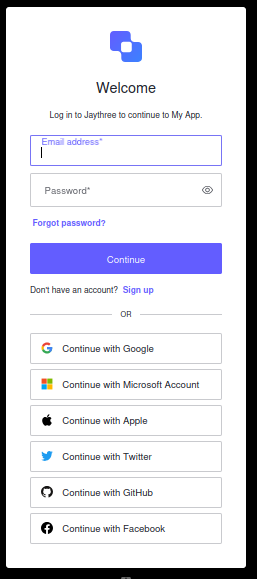
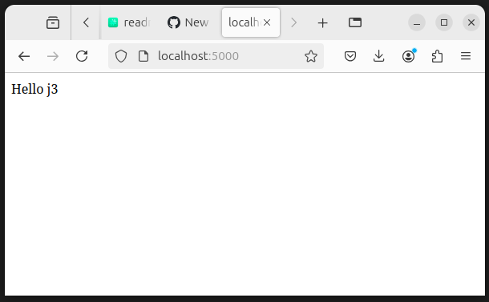
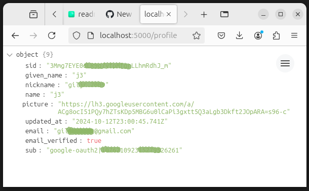

#  🪪 Auth0 Project 🪪 Express, and Passport 🪪


In this repo, we’re going to simplify the process using Auth0 and Node.js, enabling you to quickly implement secure login and user authentication in your app. Whether you're building your first login system or refining an existing one, this step-by-step guide will give you the tools you need to succeed. Let’s dive in and make secure authentication simple and effective!
Ready to dive in? Explore the project on my GitHub!

🔹 What's New in this APP?

    
    Dive into this tutorial to learn how to implement 
    OAuth 2.0 authentication using Auth0 and Node.js.
    Welcome o/

Ready to dive in? Check out the GitHub repository for full instructions and code:

### Tutorial: 

👉 [Seamless Auth with Auth0, Express, and Passport: A Quick Guide 🎉](https://medium.com/jungletronics/seamless-auth-with-auth0-express-and-passport-a-quick-guide-21d57d784e9d)

Learn how to integrate secure authentication in your Node.js app using Auth0, Express, and Passport with minimal setup


## Screenshots

| localhost:5000/login | Choose An Account |
|---------------|---------------|
|  |  |
| localhost:5000/ | localhost:5000/profile |
|  |  |


## Installation Guide

Follow these steps to set up the project locally on your machine:
Prerequisites

Make sure you have the following installed:

    Node.js (v14 or later)
    npm (Node Package Manager, comes with Node.js)
    Git (for cloning the repository)

### Steps to Install

#### 1) Clone the Repository

Open your terminal and run the following command to clone the repository:

    
   **`git clone https://github.com/giljr/my-auth0-app.git`**


#### 2) Navigate to the Project Directory

Change your directory to the cloned project:

    cd my-auth0-app

### 3) Install Dependencies

Run the following command to install the required dependencies:

    npm install

#### 4) Set Up Environment Variables

Create a ``.env`` file in the root of the project and add the following variables:

    AUTH0_DOMAIN=your-auth0-domain
    AUTH0_CLIENT_ID=your-auth0-client-id
    AUTH0_CLIENT_SECRET=your-auth0-client-secret
    AUTH0_CALLBACK_URL=http://localhost:5000/callback
    AUTH0_SECRET=your-session-secret
    BASE_URL=http://localhost:5000

Replace the placeholders with your actual [Auth0](https://auth0.com/) configuration values.

#### 5) Start the Application

Use the following command to start the application:

    npm start

#### 6) Access the Application

Open your web browser and navigate to

    http://localhost:5000 

to view your application.

##### Additional Information

For further configuration and usage details, please refer to the [auth0.com](https://auth0.com/) and 

[passportjs.org](https://www.passportjs.org/concepts/authentication/sessions/) Session Documentations.

##### To deploy this project run

```bash
  npm run deploy
```


## Acknowledgements

 - [ Luiz Felipe Batista Moschini ](https://www.linkedin.com/in/luiz-felipe-batista-moschini-4938a0211)

## Authors

- [@j3](https://github.com/giljr)


## 🚀 About Me
I'm a Full Stack Developer with a degree in Computer Engineering. You can explore my work and projects on my GitHub repository:

[GitHub Repo](https://github.com/giljr/fiscal_service_app)


## License

[MIT](https://choosealicense.com/licenses/mit/)

